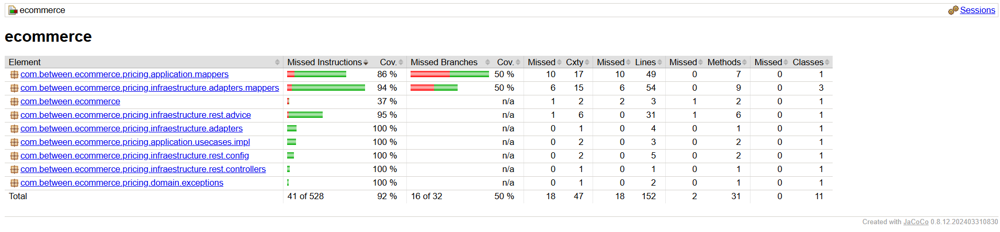

# Prueba tecnica Between - Spring Boot Application

## Descripción

Este proyecto es una aplicación de Spring Boot que implementa un servicio REST para consultar los precios de un producto para una marca específica en una fecha dada. Utiliza una base de datos en memoria (H2) para almacenar los datos de ejemplo y está diseñado siguiendo la **arquitectura hexagonal** (también conocida como puertos y adaptadores), lo que permite un mejor desacoplamiento entre las capas de dominio y la infraestructura.

La aplicación se inicializa con una tabla de precios (`PRICES`), que contiene información sobre las tarifas aplicables a productos de una cadena de tiendas dentro de un rango de fechas.

## Requisitos

- **Java 17** o superior
- **Maven 3.8** o superior

## Ejecución

### Clonar el repositorio

```bash
git clone https://github.com/mac930328/prueba-tecnica-between.git
cd prueba-tecnica-between
```

## Estructura de Carpetas

El proyecto sigue la estructura típica de un proyecto Spring Boot con arquitectura hexagonal.

```bash
ecommerce
│
├── src
│   ├── main
│   │   ├── java
│   │   │   └── com
│   │   │       └── between
│   │   │           └── ecommerce
│   │   │               ├── EcommerceApplication.java
│   │   │               ├── pricing                     
│   │   │               ├── domain
│   │   │               │   ├── models
│   │   │               │   │   ├── Price.java
│   │   │               │   │   ├── Product.java
│   │   │               │   │   └── Brand.java
│   │   │               │   ├── repositories
│   │   │               │   │   └── PriceRepository.java
│   │   │               │   └── exceptions
│   │   │               │       └── NotFoundException.java
│   │   │               ├── application
│   │   │               │   ├── dtos
│   │   │               │   │   └── PriceDto.java
│   │   │               │   ├── mappers
│   │   │               │   │   └── PriceDtoMapper.java
│   │   │               │   └── usecases
│   │   │               │       ├── impl
│   │   │               │       │   └── PriceUseCaseImpl.java
│   │   │               │       └── PriceUseCase.java
│   │   │               └── infrastructure
│   │   │                   ├── rest
│   │   │                   │   ├── advice
│   │   │                   │   │   └── MyControllerAdvice.java
│   │   │                   │   ├── config
│   │   │                   │   │   └── OpenApiConfig.java
│   │   │                   │   ├── controllers
│   │   │                   │   │   └── PriceController.java
│   │   │                   │   └── exceptions
│   │   │                   │       └── GlobalError.java  
│   │   │                   └── adapters
│   │   │                       ├── PriceH2Adapter.java
│   │   │                       ├── entities
│   │   │                       │   ├── PriceEntity.java
│   │   │                       │   ├── BrandEntity.java
│   │   │                       │   └── ProductEntity.java
│   │   │                       ├── mappers
│   │   │                       │   ├── PriceEntityMapper.java
│   │   │                       │   ├── BrandEntityMapper.java
│   │   │                       │   └── ProductEntityMapper.java
│   │   │                       └── repository
│   │   │                           └── PriceJpaRepository.java
│   │   └── resources
│   │       ├── application.properties                          
│   │       └── data.sql                                         
│   └── test
│       ├── java
│       │   └── com
│       │       └── between
│       │           └── ecommerce
│       │               ├── EcommerceApplicationTest.java
│       │               └── pricing
│       │                   ├── application
│       │                   │   └── mappers
│       │                   │       └── PriceDtoMapperTest.java
│       │                   └── infrastructure
│       │                       ├── adapters
│       │                       │   ├── PriceH2AdapterTest.java
│       │                       │   ├── mappers
│       │                       │   │   ├── BrandEntityMapperTest.java
│       │                       │   │   ├── PriceEntityMapperTest.java
│       │                       │   │   └── ProductEntityMapperTest.java
│       │                       │   └── repository
│       │                       │       └── PriceJpaRepositoryTest.java
│       │                       └── rest
│       │                           └── controllers
│       │                               └── PriceControllerTest.java
│       └── resorces
│           ├── application.properties                          
│           └── data-test.sql 
├── pom.xml                                                     
└── README.md                                                    
```

## Construir el proyecto
```bash
mvn clean install
```

## Ejecutar la aplicación
```bash
mvn spring-boot:run
```
La aplicación estará disponible en http://localhost:8080.

## Endpoints
### Consultar precio

Este es el único endpoint de la aplicación, que permite obtener el precio de un producto basado en una fecha, identificador del producto y de la cadena.

- Endpoint: GET /api/price
- Parámetros:
  - applicationDate: Fecha y hora en la que se desea consultar el precio (formato yyyy-MM-ddTHH:mm:ss).
  - productId: Identificador del producto.
  - brandId: Identificador de la marca.

#### Ejemplo de petición
```bash
curl -X GET "http://localhost:8080/api/price?applicationDate=2020-06-14T16:00:00&productId=35455&brandId=1"
```

#### Ejemplo de respuesta
```json
{
  "priceList": 2,
  "productId": 35455,
  "brandId": 1,
  "startDate": "2020-06-14T15:00:00",
  "endDate": "2020-06-14T18:30:00",
  "price": 25.45
}
```

## Base de datos H2
La base de datos H2 se inicializa automáticamente con los siguientes datos de ejemplo:

| BRAND_ID | START_DATE          | END_DATE             | PRICE_LIST | PRODUCT_ID | PRIORITY | PRICE	 | CURR |
|----------|---------------------|----------------------|------------|------------|----------|--------|------|
| 1        | 2020-06-14 00:00:00 | 2020-12-31 23:59:59  | 1          | 35455      | 0        | 35.50  | EUR  |
| 1	       | 2020-06-14 15:00:00 | 2020-06-14 18:30:00  | 2          | 35455      | 1        | 25.45  | EUR  |
| 1	       | 2020-06-15 00:00:00 | 2020-06-15 11:00:00  | 3          | 35455      | 1        | 30.50  | EUR  |
| 1	       | 2020-06-15 16:00:00 | 2020-12-31 23:59:59  | 4          | 35455      | 1        | 38.95  | EUR  |

Puedes acceder a la consola de H2 en http://localhost:8080/h2-console con las siguientes credenciales:

- JDBC URL: jdbc:h2:mem:appdb
- User: sa
- Password: sa

## Pruebas
El proyecto incluye un conjunto de pruebas que validan las siguientes consultas al servicio:

1. Petición a las 10:00 del 14 de junio de 2020 para el producto 35455 y la marca 1 (ZARA)
2. Petición a las 16:00 del 14 de junio de 2020 para el producto 35455 y la marca 1 (ZARA)
3. Petición a las 21:00 del 14 de junio de 2020 para el producto 35455 y la marca 1 (ZARA)
4. Petición a las 10:00 del 15 de junio de 2020 para el producto 35455 y la marca 1 (ZARA)
5. Petición a las 21:00 del 16 de junio de 2020 para el producto 35455 y la marca 1 (ZARA)

Para ejecutar las pruebas:
```bash
mvn clean test
```
La covertura se realizo utilizando JaCoCo y se puede visualizar en la siguiente ruta:
```bash
target/site/jacoco/index.html
```


## Documentación OpenAPI (Swagger)
La documentación de la API se genera automáticamente y se puede acceder a ella en http://localhost:8080/swagger-ui.html después de ejecutar la aplicación.

Asi mismo puedes encontrar el json en http://localhost:8080/api-docs